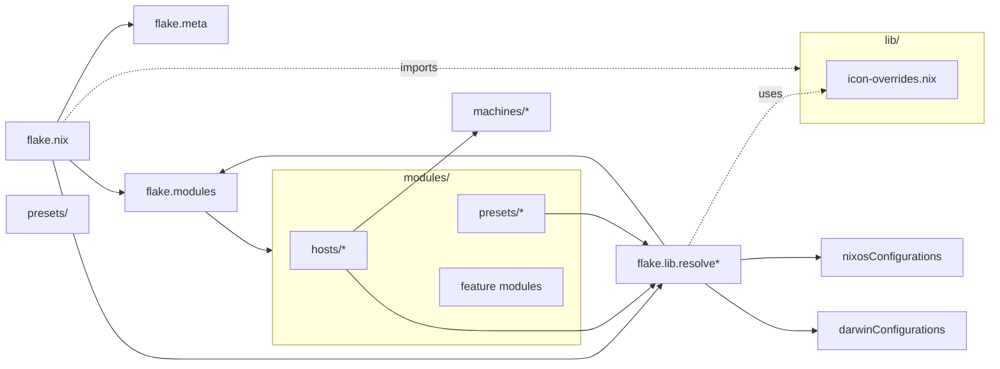

# ❄️ NixOS

Personal NixOS configuration using a dendritic module layout with flake-parts.

**Quick Start:**
```sh
nh os switch          # Build and switch
nh os test            # Test without switching
nh os switch --update # Update and rebuild
```

**Hosts:** rvn-pc, rvn-srv, rvn-vm

Fresh installation? See [docs/INSTALLATION.md](docs/INSTALLATION.md).

## Common Tasks

> **Note:** This configuration uses [`nh`](https://github.com/nix-community/nh) (Nix Helper) for simplified system management.

### Manage Dotfiles

My dotfiles (https://github.com/fbosch/dotfiles) are applied via Home Manager using GNU Stow.

The repository is **initially pinned** to a specific ref for reproducibility. When actively iterating on dotfiles:

1. Switch to the default branch in the dotfiles repo
2. Make changes and test
3. When stable, pin to a new commit in `flake.nix`

This keeps dotfiles consistent across Nix and non-Nix hosts.

### Update Dependencies

```sh
# Update and rebuild in one command
nh os switch --update

# Or update without rebuilding
nix flake update
```

### Clean Up Old Generations

```sh
nh clean all  # Auto-cleanup (keeps last 15 or from last 7 days)
```

### Search Packages

```sh
nh search <package-name>
```

### Lint & Format

```sh
nix run .#lint   # statix + deadnix checks
nix run .#fmt    # nixpkgs-fmt formatting
```

## Layout

```text
assets/            screenshots and art
configs/           shared config files (gpg, etc)
docs/              guides and agent docs
lib/               pure utility functions
  icon-overrides.nix    icon theme customization
machines/          machine-specific NixOS configs
  desktop/         desktop machine hardware config
  msi-cubi/        MSI Cubi hardware config
  virtualbox-vm/   VirtualBox VM config
modules/
  flake-parts/     meta, overlays, hosts loader, lib wiring
  hosts/           one file per machine → nixosConfigurations.<name>
  presets/         desktop, server presets
  applications/    GUI apps (browsers, gaming, file management)
  desktop/         desktop environment (hyprland, gtk, audio)
  development/     dev tools (git, nodejs, python, ai)
  hardware/        hardware-specific (fingerprint, storage, fancontrol)
  services/        system services (plex, home-assistant, attic)
  shell/           shell tools (fish, starship, direnv, eza)
  system/          system config (ananicy, scheduled-suspend)
  virtualization/  docker, libvirt
  *.nix            core modules (users, fonts, security, nas, sops)
pkgs/by-name/      local packages
scripts/           helper scripts
secrets/           sops files
```



## Module wiring

Modules are resolved using helpers from `flake.lib`:

- `config.flake.lib.resolve [ "module-name" ]` - Resolves NixOS modules
- `config.flake.lib.resolveHm [ "module-name" ]` - Resolves Home Manager modules
- `config.flake.lib.resolveDarwin [ "module-name" ]` - Resolves Darwin modules

**Example:**

```nix
# modules/hosts/my-machine.nix
{ config, ... }:
{
  flake.modules.nixos."hosts/my-machine" = {
    imports = config.flake.lib.resolve [
      "presets/desktop"
      "secrets"
      ../../machines/my-machine/hardware.nix  # Direct paths also work
    ];

    home-manager.users.username.imports = config.flake.lib.resolveHm [
      "secrets"
      "flatpak"
    ];
  };
}
```

## Presets

Presets are reusable module bundles that provide a baseline configuration:

**Available:**

- `presets/desktop` - Full desktop environment with Hyprland, GUI apps, development tools
- `presets/server` - Minimal server configuration

## Troubleshooting

### `nh` can't find flake

- The `NH_FLAKE` environment variable is set in `modules/system/nh.nix`
- Points to `/home/<username>/nixos` for NixOS hosts
- Points to `/Users/<username>/nixos` for Darwin hosts
- If `nh` commands fail, use absolute flake path: `nh os switch /path/to/nixos`

### Secrets not decrypting

- Ensure SOPS age key exists: `~/.config/sops/age/keys.txt`
- Re-run bootstrap: `./scripts/bootstrap-age.sh`
- Check `.sops.yaml` has the correct age public key

### Module not found errors

- Module paths are relative to `modules/` directory
- Use `config.flake.lib.resolve` for NixOS modules
- Use `config.flake.lib.resolveHm` for Home Manager modules
- Direct file paths (../../machines/...) also work

### Build fails after flake update

- Check if any inputs introduced breaking changes
- Roll back specific input: `git restore flake.lock` then selectively update
- Use `nixos-rebuild --fallback` to build from source if cache fails

## Credits

- Dendritic pattern — https://vic.github.io/dendrix/
- Inspiration — https://github.com/MrSom3body/dotfiles
- Inspiration — https://github.com/drupol/infra
- Fastfetch ANSI art — https://github.com/4DBug/nix-ansi

---

_Last reviewed: January 2026_
