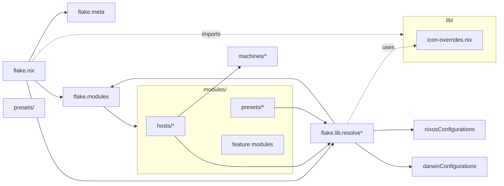

# ❄️ NixOS

This is my personal NixOS configuration.

It uses a dendritic module layout with flake-parts.

Installation steps are in [docs/INSTALLATION.md](docs/INSTALLATION.md).

## Lint & format

```sh
nix run .#lint   # statix + deadnix
nix run .#fmt    # nixpkgs-fmt
```

## Dotfiles

My dotfiles (https://github.com/fbosch/dotfiles) are applied via a Home Manager module that runs GNU Stow.

Useful when you need the same dotfiles on non‑Nix hosts.

For reproducibility, the repository is initially pinned to a specific ref. You can switch to the default branch to iterate without rebuilding Nix every time.

## Layout

```text
assets/            screenshots and art
configs/           shared config files (gpg, etc)
docs/              guides and agent docs
lib/               pure utility functions
  icon-overrides.nix    icon theme customization
machines/          machine-specific NixOS configs
modules/
  flake-parts/     meta, overlays, hosts loader, lib wiring
  hosts/           one file per machine → nixosConfigurations.<name>
  presets/         desktop, server presets
  applications/    GUI apps (browsers, gaming, file management)
  desktop/         desktop environment (hyprland, gtk, audio)
  development/     dev tools (git, nodejs, python, ai)
  hardware/        hardware-specific (fingerprint, storage, fancontrol)
  services/        system services (plex, home-assistant, attic)
  shell/           shell tools (fish, starship, direnv, eza)
  system/          system config (ananicy, scheduled-suspend)
  virtualization/  docker, libvirt
  *.nix            core modules (users, fonts, security, nas, sops)
pkgs/by-name/      local packages
scripts/           helper scripts
secrets/           sops files
```



## Module wiring

Modules are resolved using helpers from `flake.lib`:

- `config.flake.lib.resolve [ "module-name" ]` - Resolves NixOS modules
- `config.flake.lib.resolveHm [ "module-name" ]` - Resolves Home Manager modules
- `config.flake.lib.resolveDarwin [ "module-name" ]` - Resolves Darwin modules

**Example:**

```nix
# modules/hosts/my-machine.nix
{ config, ... }:
{
  flake.modules.nixos."hosts/my-machine" = {
    imports = config.flake.lib.resolve [
      "presets/desktop"
      "secrets"
      ../../machines/my-machine/hardware.nix  # Direct paths also work
    ];
    
    home-manager.users.username.imports = config.flake.lib.resolveHm [
      "secrets"
      "flatpak"
    ];
  };
}
```

## Presets

Presets are reusable module bundles:

**Available:**
- `presets/desktop` - Full desktop environment with all features
- `presets/server` - Minimal server configuration

## Credits

- Dendritic pattern — https://vic.github.io/dendrix/
- Inspiration — https://github.com/MrSom3body/dotfiles
- Inspiration — https://github.com/drupol/infra
- Fastfetch ANSI art — https://github.com/4DBug/nix-ansi
