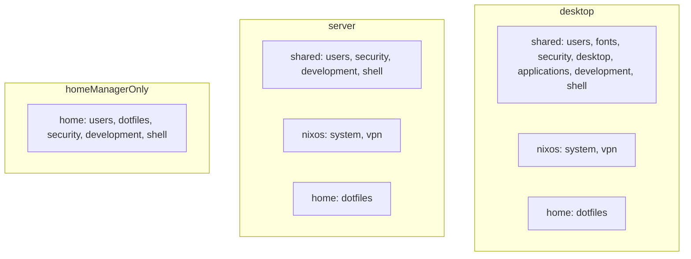

# ❄️ NixOS

This is my personal NixOS configuration.

It uses a dendritic module layout with flake-parts.

## Lint & format

```sh
nix run .#lint   # statix + deadnix
nix run .#fmt    # nixpkgs-fmt
```

## Dotfiles

My dotfiles (https://github.com/fbosch/dotfiles) are applied via a Home Manager module that runs GNU Stow.

Useful when you need the same dotfiles on non‑Nix hosts.

For reproducibility, the repository is initially pinned to a specific ref. You can switch to the default branch to iterate without rebuilding Nix every time.

## Layout

```text
modules/
  flake-parts/   host loader, overlays, meta
  hosts/         one file per machine → nixosConfigurations.<name>
  *.nix          single-purpose modules (desktop, apps, dev, shell, system)
pkgs/by-name/    local packages
```


## Module wiring

Modules listed under a preset or host `modules` list are applied to both NixOS and Home Manager. Use the `nixos` list for system-only modules and `homeManager` for user-only modules. A module file can export both `flake.modules.nixos.<name>` and `flake.modules.homeManager.<name>` so a single entry in `modules` wires both sides.

## Presets



## Credits

- Dendritic pattern — https://vic.github.io/dendrix/
- Inspiration — https://github.com/MrSom3body/dotfiles
- Inspiration — https://github.com/drupol/infra
- Fastfetch ANSI art — https://github.com/4DBug/nix-ansi
